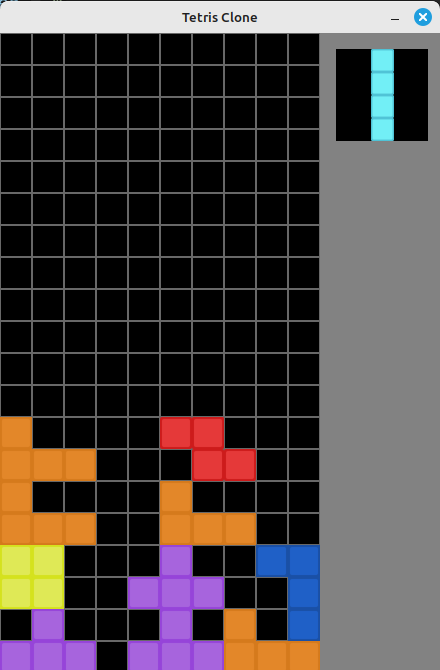

# Tetris Clone (Incomplete)

Creating a Tetris clone in C to practice C programming and learn more about Raylib (awesome library btw!).

## Description

This game is a clone of the popular game Tetris. This clone features what you would expect from a simplistic version of Tetris, namely: falling blocks, which upon completion of a row disappear, score keeping and levels with incremental difficulty.

Here are some early screenshots of my progress:




Features left to implement:
- Update codebase to use cohesive style (still haven't landed on exactly what I like)
- Re-Implement rotation algorithm; my original algorithm was extremely buggy
- Empty rows that are full should "break"
- Broken rows should cause other rows to shift down without losing ordering
- scoring system
- display upcoming block
- introduce levels and increasing speed/score multiplier

I hope you enjoy!

## Getting Started

### Dependencies

* Describe any prerequisites, libraries, OS version, etc., needed before installing program.

### Installing

* How/where to download your program
* Any modifications needed to be made to files/folders

### Executing program

* How to run the program
* Step-by-step bullets
```
code blocks for commands
```

## Help

## Authors

Contributors names and contact info

John Landers [jcolelanders@gmail.com](mailto:jcolelanders@gmail.com)

## Version History

* 0.1
    * Initial Release

## License

This project is licensed under the MIT License - see the LICENSE file for details

## Acknowledgments

Inspiration, code snippets, etc.
* [Tetris](https://en.wikipedia.org/wiki/Tetris)
* [raylib](https://github.com/raysan5/raylib)
